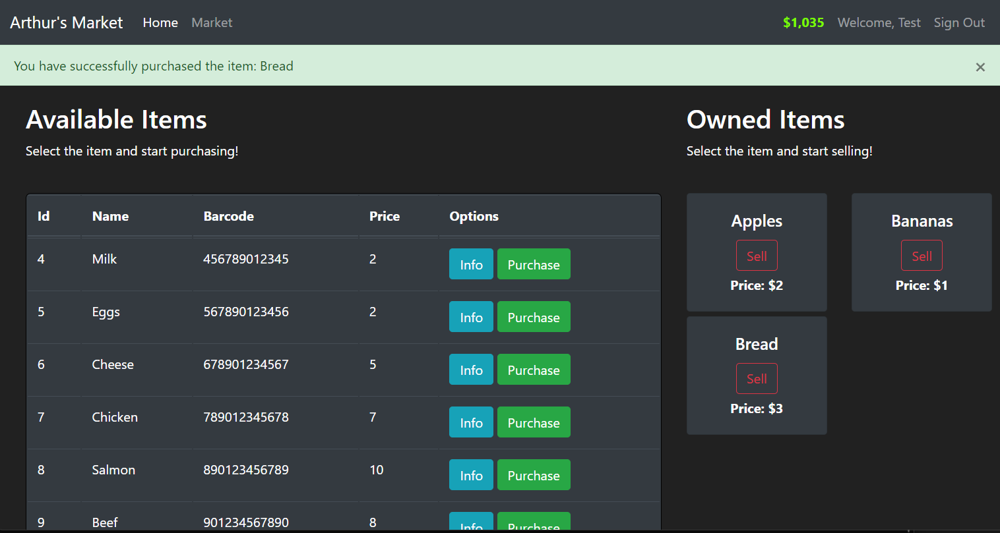

# SentimentWatch

FlaskMarket is a web application built using Python and Flask simulating an e-commerce.

<div align="center">
  <a href="https://github.com/othneildrew/Best-README-Template">
    
  </a>
</div>

## Table of Contents

1. [Prerequisites](#prerequisites)
2. [Installation](#installation)
3. [Running the Application](#running-the-application)
4. [Contributing](#contributing)
5. [License](#license)

## Prerequisites

Before you begin, make sure you have the following software installed on your system:

- Python 3.8 or higher
- Git (for cloning the repository)

## Installation

Follow these steps to set up the application on your local machine:

1. Clone the repository:
   ```
   git clone https://github.com/artsaraiva/Flask-Market.git
   ```
2. Change to the root directory:
   ```
    cd Flask-Market
   ```
3. Install the required Python packages using pip:
   ```
    pip install -r requirements.txt
   ```

## Running the Application

To run the application, execute the following command from the root directory:
   ```
   python app.py
   ```
   
Now, open your web browser and navigate to `http://127.0.0.1:5000` to view the application.

## Contributing

We welcome contributions to this project. If you would like to contribute, please follow these steps:

1. Fork the repository
2. Create a new branch for your feature or bugfix
3. Commit your changes
4. Push your changes to your fork
5. Submit a pull request to the main repository

## License

This project is licensed under the MIT License. See the [LICENSE](LICENSE) file for details.
